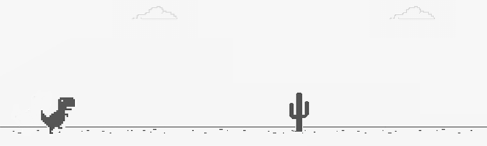

  

## Hi there 👋, I'm Jackie. 
Welcome to my corner of the web!

### A little bit about me...

I'm a full-stack web developer with a knack for finding and solving problems. When I'm not pushing commits, you'll often catch me setting up spikes on the volleyball court, building extravagant mansions in The Sims, or chasing my dog down the beach. 🐶

- - - - 

### Programming Languages and Tools:

              

- - - -

### 👩🏻‍🔧 I'm currently working on...
 * [My personal portfolio website!](https://jackieodonnell.netlify.app/ "portfolio")
 * [WORDCRAFT: an original mobile word game](https://wordcraft.netlify.app/)
 * [PayBack Money Transfer App - KPI Live Dashboard](https://github.com/jackieodonnell/PayBack-AdminDashboard)

- - - -

### 👇 ~~Find me on social media:~~
Just kidding, I'm off-the-grid! But you can give me a shout here: 
 or here: 

- - - - 
### 👀 Wanna see what I've been up to?

NOTE: This does not indicate my skill level or language proficiency, it's merely a GitHub metric of which languages I have the most code of on GitHub.

### 🎧 Currently listening to...

  
